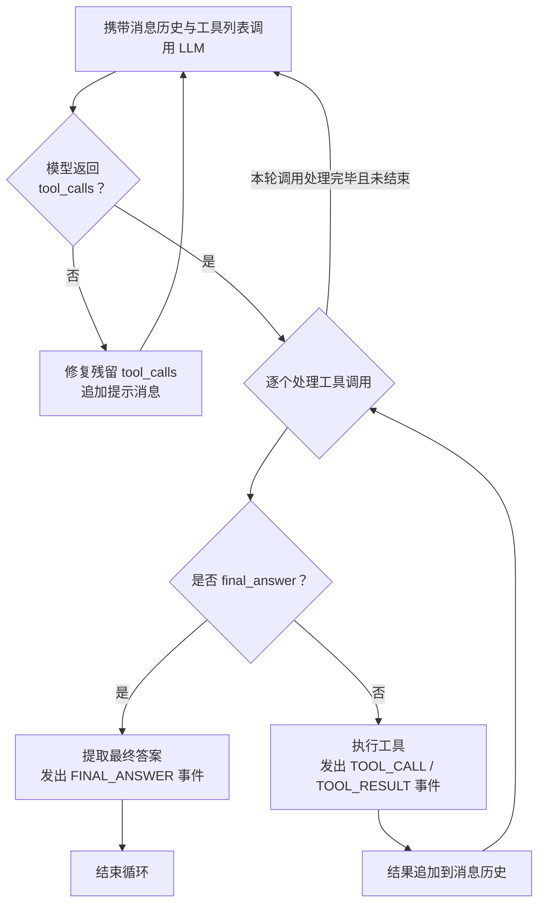

# ReAct 智能体

ReAct（Reasoning + Acting）是目前构建智能体的经典范式：模型在循环中不断「思考—调用工具—观察结果」，直到能够给出最终答案。`ReActAgentExecutor` 就是这个范式的实现，它把循环编排、工具调度、消息历史维护都封装起来，我们只需要提供客户端、工具和初始消息。单轮循环的执行流程如下。



## 基本用法

```java
ReActAgentExecutor agent = ReActAgentExecutor.builder()
        .defaultLlmClient(llmClient)
        .toolRegistry(toolRegistry)
        .defaultToolNames(List.of("query_weather"))
        .maxIterations(30)
        .build();

Flux<AgentResponse> events = agent.execute(AgentContext.builder()
        .contextId("session-001")
        .messages(List.of(
                new SystemMessage("你是一个天气助手"),
                new UserMessage("北京今天天气怎么样？")))
        .build());
```

执行器的几个构建参数：

- `defaultLlmClient`：默认的 LLM 客户端，`AgentContext` 中未指定客户端时使用
- `toolRegistry`：工具注册中心，注入 Starter 自动装配的 Bean 即可
- `defaultToolNames`：默认启用的工具名列表，`AgentContext` 中未指定工具时使用
- `maxIterations`：最大循环轮数，默认 50，超限后以 `ERROR` 事件结束，防止模型陷入死循环

`execute` 返回 `Flux<AgentResponse>` 事件流。执行过程在 `boundedElastic` 调度器上异步进行。

## 执行上下文 AgentContext

`AgentContext` 承载一次智能体执行的全部状态。

| 字段 | 说明 |
|---|---|
| `contextId` | 会话上下文 ID，框架不消费，供业务侧关联会话 |
| `messages` | 消息列表，执行过程中会不断追加助手消息和工具结果 |
| `llmClient` | 本次执行使用的客户端，为 `null` 时使用执行器的默认客户端 |
| `toolNames` | 本次执行启用的工具名列表，为空时使用执行器的默认工具列表 |
| `temperature` / `topP` / `topK` / `presencePenalty` / `frequencyPenalty` / `seed` / `maxTokens` | 采样参数，语义与 `ChatRequest` 一致 |
| `enableThinking` | 是否开启思考，前提是模型声明了 `reasoning` 能力 |
| `streaming` | 是否流式输出思考与最终回答内容，默认 `false` |
| `variables` | 自定义变量 Map，供工具读写共享状态 |

`messages` 是可变的：执行器每轮会把模型的助手消息和工具执行结果追加进去。执行结束后，我们可以通过 `context.getMessages()` 拿到完整的对话历史，用于持久化或下一次续聊。

`variables` 是工具之间共享状态的通道。工具方法声明 `AgentContext` 参数后，会拿到执行时点的上下文快照，对快照中 `variables` 的修改会在工具执行完成后合并回主上下文。消息列表等其它字段的修改则不会回传，这是有意的防御性设计，避免工具误改对话状态。一个典型的用法是让工具记录执行过程中的业务数据，供后续工具或业务代码消费。

```java
@AgenticTool(name = "query_order", description = "查询订单")
public String queryOrder(OrderQuery query, AgentContext ctx) {
    Order order = orderService.get(query.getOrderNo());
    ctx.getVariables().put("currentOrder", order); // 共享给后续工具
    return toJson(order);
}
```

由于上下文中可以切换客户端和工具列表，同一个执行器实例可以服务多个模型、多套工具组合，每次执行通过 `AgentContext` 隔离。

## 事件流 AgentResponse

智能体的每一步进展都会以 `AgentResponse` 事件的形式从事件流中发出，事件类型如下。

| 事件类型 | 说明 | 产生的时机 |
|---|---|---|
| `THINKING` | 思考内容（reasoning） | 每轮模型返回了思考内容时（完整内容） |
| `TOOL_CALL` | 发起工具调用 | 模型决定调用工具时，携带 toolCallId、toolName、toolArguments |
| `TOOL_RESULT` | 工具执行结果 | 工具执行完成后，携带 toolCallId、toolName、结果文本 |
| `FINAL_ANSWER` | 最终回答 | 模型调用内置 `final_answer` 工具时，执行随之结束 |
| `ERROR` | 执行出错 | 循环内抛出异常或达到最大轮数时 |
| `THINKING_DELTA` | 思考内容增量片段 | 仅 `streaming=true` 时，随流式分片实时产生 |
| `FINAL_ANSWER_DELTA` | 最终回答增量片段 | 仅 `streaming=true` 时，随流式分片实时产生 |
| `STOPPED` | 执行被停止 | `requestStop()` 请求停止生效时，发出后事件流正常完成 |

前端对接时，一般按事件类型分别渲染：思考内容放到折叠区域，工具调用展示为执行步骤，`FINAL_ANSWER`（或其 delta 流）渲染为正式回答。

## 流式模式

`AgentContext.streaming` 默认为 `false`，此时每轮的思考和最终回答在模型完整返回后一次性以 `THINKING` / `FINAL_ANSWER` 事件发出。设置为 `true` 后，执行器改用流式调用，并实时发出两种增量事件：`THINKING_DELTA` 对应模型的思考分片，`FINAL_ANSWER_DELTA` 对应最终回答的内容分片。

这里有一个实现细节值得了解：最终回答是通过内置的 `final_answer` 工具提交的，它的内容位于工具调用参数的 JSON 中（`{"message": "..."}`），流式传输时 JSON 是分片到达的。执行器内置了一个增量 JSON 解析器，从拼接到一半、甚至转义序列被截断的 JSON 参数中实时解码出 `message` 字段的文本，因此我们收到的 `FINAL_ANSWER_DELTA` 是纯文本内容，不含 JSON 语法噪音。

无论是否开启流式，每轮结束时完整的 `THINKING`、`TOOL_CALL`、`TOOL_RESULT`、`FINAL_ANSWER` 事件依然会照常发出，订阅方可以同时消费两类事件：delta 用于打字机渲染，完整事件用于存档。

## 循环的收口：final_answer

ReAct 循环最大的工程问题是如何让模型明确地结束循环。框架的做法是内置一个 `final_answer` 工具，它与业务工具一起提供给模型，模型调用它即表示提交最终答案并结束循环。`final_answer` 在工具列表中固定存在，我们不需要也无法注册同名工具。

相应地，如果模型在某一轮没有发起任何工具调用，执行器会向消息历史追加一条提示消息（告知模型必须调用 `final_answer` 结束或调用工具继续），然后进入下一轮，而不是直接把文本当作答案。这个设计强制了「答案必须从 final_answer 出来」的契约，让事件消费方的处理逻辑保持简单。

另外，执行器对异常场景做了兜底：如果模型返回中残留了未执行的 tool_calls（例如因 `length` 截断而结束），框架会自动补上对应的工具结果消息并注明未执行的原因，保证消息历史中每个 tool_call 都有配对的结果——否则下一轮请求会直接被端点拒绝；工具参数不是合法 JSON 时（典型的截断场景），不会真正执行工具，而是把错误信息作为工具结果反馈给模型。

## 停止与取消

执行提供两种停止方式，分别对应「业务主动停止」与「订阅方放弃」两类场景。

### 请求停止：requestStop

`AgentContext.requestStop()` 是业务侧主动停止执行的入口，典型用法是响应用户的「停止」按钮：

```java
AgentContext context = AgentContext.builder()
        .messages(List.of(new UserMessage("帮我分析这份日志")))
        .build();
Flux<AgentResponse> events = executor.execute(context);

// 业务侧需要停止时调用，线程安全
context.requestStop();
```

请求停止后，执行器在以下协作点生效：每一轮循环开始前、每次 LLM 调用返回后、每个工具执行前、流式接收的每个分片处。生效时事件流发出一个 `STOPPED` 事件并正常完成，订阅方据此即可区分「正常结束」与「被停止」。

停止过程的几个保证：

- **消息历史保持完整**：停止时本轮尚未执行的 tool_call 会自动补上注明取消的工具结果消息，历史中每个 tool_call 都有配对结果，上下文可直接用于再次 `execute` 续聊
- **流式中的部分响应会被丢弃**：停止时正在接收的模型响应不写入消息历史（已发出的增量事件不受影响），避免历史中残留参数截断一半的 tool_call
- **工具可感知停止**：工具方法声明的 `AgentContext` 参数与主上下文共享停止标志，耗时工具可以自行轮询 `isStopRequested()` 提前返回

### 取消订阅：dispose

订阅方调用 `Disposable.dispose()`（或 `take(n)` 截断、WebFlux 请求断开等）同样会停止执行，协作点与 `requestStop` 相同，流式模式下会向上游传播取消并主动关闭 SSE 连接。区别在于这是放弃式的：事件流直接终止，`STOPPED` 事件随订阅的消失而无法送达，执行器在后台收尾到下一个协作点后退出。消息历史的配对完整性同样有保障。

### 共同边界

两种方式都是协作式的：**正在执行中的工具方法不会被中断**（Java 无法安全中断任意业务代码），它会执行完毕，只是后续的循环和工具调用不再继续。耗时或高危工具应自行支持中断（轮询停止标志、销毁子进程等），或拆分为可轮询的两段式操作。如需可恢复的暂停而非停止，请使用智能体拦截器的 `suspendWith`（见「智能体拦截器」一章）。

## 运行期行为的提示

执行器中工具调用是同步执行的，事件发射与工具执行在同一个 `boundedElastic` 线程上。如果工具本身耗时较长（如调用慢速的外部接口），整轮循环会被拉长，这是 ReAct 范式的固有特性；如果业务对延迟敏感，应尽量让工具内部实现保持轻量，重活异步化后通过 `variables` 或轮询类工具获取结果。
