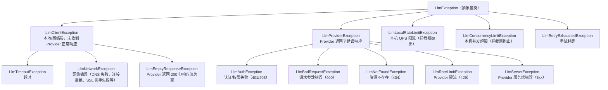

# 异常体系

LLM 调用的失败原因五花八门：网络不通、超时、认证失败、参数错误、限流、服务端故障等。框架将所有这些异常统一映射到 `LlmException` 体系，让我们可以用一致的方式处理失败，也为自动重试提供了判断依据。

## 异常层次结构



基类 `LlmException` 上带有四个通用字段。

| 字段 | 说明 |
|---|---|
| `errorCode` | 错误码枚举 `LlmErrorCode` |
| `provider` | 提供商标识 |
| `model` | 模型名 |
| `retryable` | 是否可重试，`RetryInterceptor` 依据该标记决定是否重试 |

`LlmProviderException` 额外携带了 Provider 响应的细节：`statusCode`（HTTP 状态码）、`responseBody`（原始响应体）、`providerErrorCode`（Provider 返回的业务错误码，解析自响应体中的 `error.code`）、`retryAfterMillis`（429 响应中 `Retry-After` 头换算出的毫秒数，可能为 `null`）。

## HTTP 错误映射

客户端会将 HTTP 错误状态码按下表映射为具体异常。

| HTTP 状态码 | 异常 | 错误码 | 可重试 |
|---|---|---|---|
| 401 / 403 | `LlmAuthException` | `PROVIDER_AUTH` | 否 |
| 400 | `LlmBadRequestException` | `PROVIDER_BAD_REQUEST` | 否 |
| 404 | `LlmNotFoundException` | `PROVIDER_NOT_FOUND` | 否 |
| 429 | `LlmRateLimitException` | `PROVIDER_RATE_LIMIT` | 是 |
| 5xx | `LlmServerException` | `PROVIDER_SERVER` | 是 |
| 其它 | `LlmProviderException` | `PROVIDER_ERROR` | 否 |

超时（连接超时、响应超时、读写超时）映射为 `LlmTimeoutException`，网络层错误（DNS 解析失败、连接拒绝、SSL 握手失败等）映射为 `LlmNetworkException`，这两者都属于 `LlmClientException` 且可重试。另外，如果 Provider 返回了 HTTP 200 但响应流中没有任何有效内容（例如只收到 `[DONE]` 或空 body，常见于内容审核拦截或网关异常），阻塞调用会抛出同样可重试的 `LlmEmptyResponseException`，而不是返回 `null`。

映射过程中，框架会尝试从响应体解析 Provider 返回的错误信息（`error.message` 和 `error.code`）拼接到异常消息中，便于排查问题；响应信息过长时会被截断到 500 字符。

## 错误码枚举

`LlmErrorCode` 完整枚举如下。

| 枚举值 | 含义 |
|---|---|
| `TIMEOUT` | 超时 |
| `NETWORK_ERROR` | 网络错误 |
| `EMPTY_RESPONSE` | Provider 返回 200 但响应流为空 |
| `PROVIDER_AUTH` | Provider 认证/权限失败 |
| `PROVIDER_BAD_REQUEST` | Provider 判定请求参数错误 |
| `PROVIDER_NOT_FOUND` | Provider 资源不存在 |
| `PROVIDER_RATE_LIMIT` | Provider 限流 |
| `PROVIDER_SERVER` | Provider 服务端错误 |
| `PROVIDER_ERROR` | Provider 其它错误 |
| `LOCAL_RATE_LIMITED` | 本机 QPS 限流 |
| `LOCAL_CONCURRENCY_LIMITED` | 本机并发超限 |
| `RETRY_EXHAUSTED` | 重试耗尽 |

## 处理异常的建议

实际业务中，我们通常按错误的性质分层处理，而不是逐一 catch 具体异常类型。

```java
try {
    ModelResponse response = llmClient.blockingChat(request);
} catch (LlmRateLimitException e) {
    // Provider 限流，可以读取 e.getRetryAfterMillis() 安排错峰重试
    // （如果挂了 RetryInterceptor，能走到这里说明重试已经耗尽）
} catch (LlmAuthException | LlmBadRequestException e) {
    // 不可重试的 Provider 错误：密钥失效、参数有误，重试无意义，需要告警或修正请求
} catch (LlmClientException e) {
    // 网络层问题：超时、DNS、连接失败等，可按重试策略处理
} catch (LlmException e) {
    // 兜底：通过 e.getErrorCode() 和 e.isRetryable() 做通用决策
}
```

需要特别注意 `LlmRetryExhaustedException`：它由 `RetryInterceptor` 在所有重试耗尽后抛出，`getAttempts()` 返回总尝试次数，`getLastCause()` 返回最后一次失败的原始异常，排查线上问题时这两个字段很关键。
