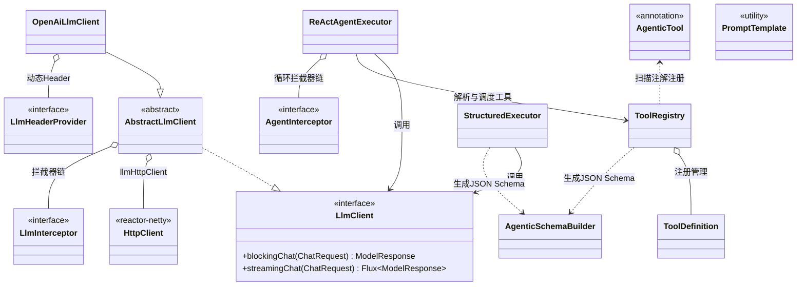

# 简介

ProArc Agentic 是一个基于 Spring Boot 的大语言模型（LLM）智能体开发框架。框架以 Spring Boot Starter 的形式提供，引入依赖后即可在工程中快速构建 LLM 多轮对话、工具调用与 ReAct 智能体应用。

## 核心能力

框架的核心类及其关系如下图所示。

从上图可以看出框架的组织方式。`llmHttpClient` 是由 Starter 自动装配的 reactor-netty 连接池，为所有 LLM 请求提供统一的连接管理；`OpenAiLlmClient` 继承 `AbstractLlmClient` 实现 `LlmClient` 接口，负责面向 OpenAI 兼容端点的阻塞与流式调用，拦截器链和动态 Header 都组合在客户端内部。`ToolRegistry` 通过扫描 `@AgenticTool` 注解收集工具，借助 `AgenticSchemaBuilder` 自动生成 JSON Schema。最顶层的 `ReActAgentExecutor` 和 `StructuredExecutor` 则把这些能力编排成可直接解决业务问题的形态：前者组合客户端与工具注册中心驱动智能体循环，后者基于强制工具调用实现结构化输出。

## 设计约定

在深入各个章节之前，有几个贯穿全框架的约定值得先了解。

**OpenAI 兼容端点是内置协议：** 框架内置的 `OpenAiLlmClient` 面向所有兼容 OpenAI Chat Completions 规范的端点，无论是 OpenAI 官方、国内的兼容服务（如阿里 DashScope 的兼容模式），还是 vLLM 等自部署推理框架，都可以直接接入。如果使用的端点不兼容 OpenAI 规范，也可以自行继承 `AbstractLlmClient` 实现自定义客户端，拦截器链与异常体系可以直接复用，具体方法见「LlmClient」一章的扩展部分。

**阻塞调用建立在流式之上：** `OpenAiLlmClient` 的阻塞式调用内部实际上是发起流式请求并聚合所有分片的结果。这样做的好处是两种调用方式的行为完全一致，拦截器、异常处理只需要针对一套链路实现，同时也避免了长文本生成时，阻塞请求容易在请求链路中的某个网关上超时的问题。

**一切皆可拦截：** 客户端层的 `LlmInterceptor` 和智能体层的 `AgentInterceptor` 都采用环绕式拦截器链设计，重试、限流、审计、人工介入等逻辑都通过拦截器挂载，而不是硬编码在主流程里。

**异常带有明确的语义：** 框架将 LLM 调用中可能出现的问题统一映射为 `LlmException` 体系，每种异常都标注了是否可重试（`retryable`），重试拦截器正是依据这个标记工作的。

接下来的快速开始章节我们会以例子的形式快速介绍如何实现LLM对话和智能体。
